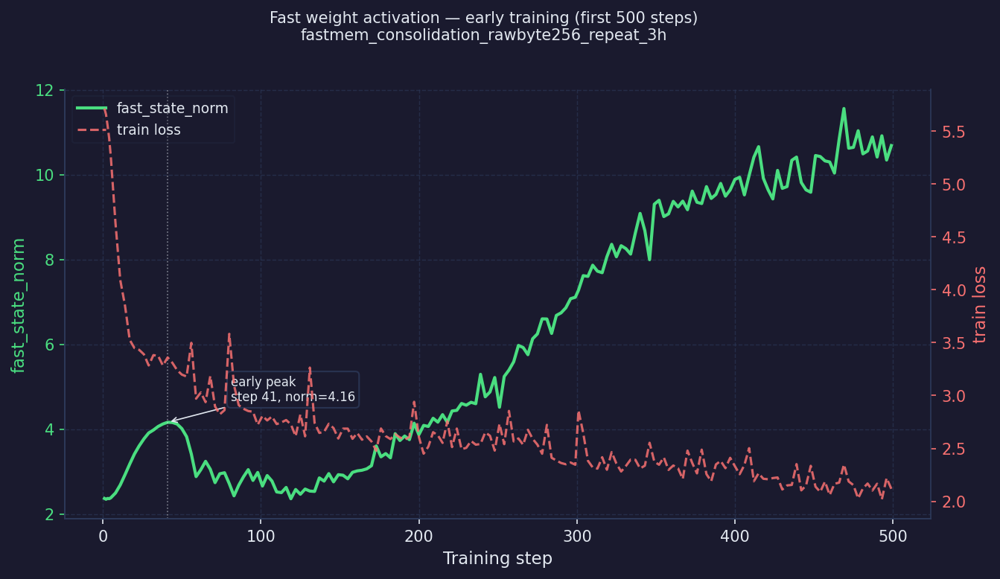
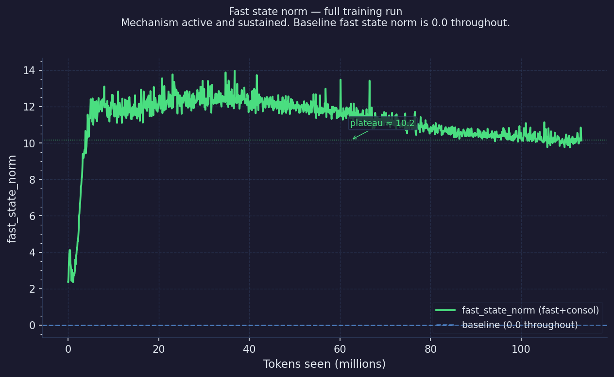
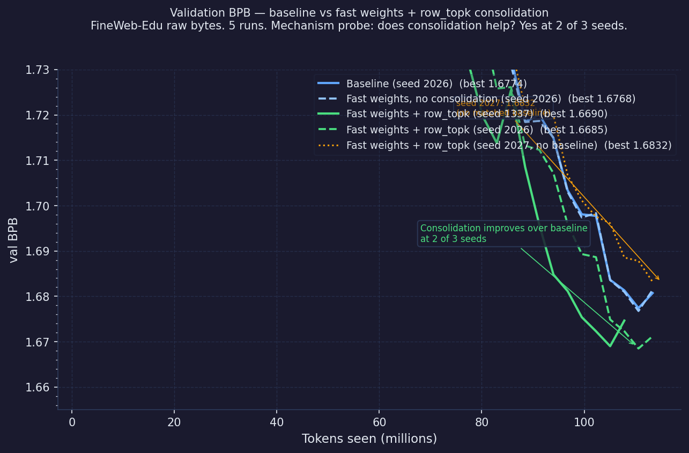
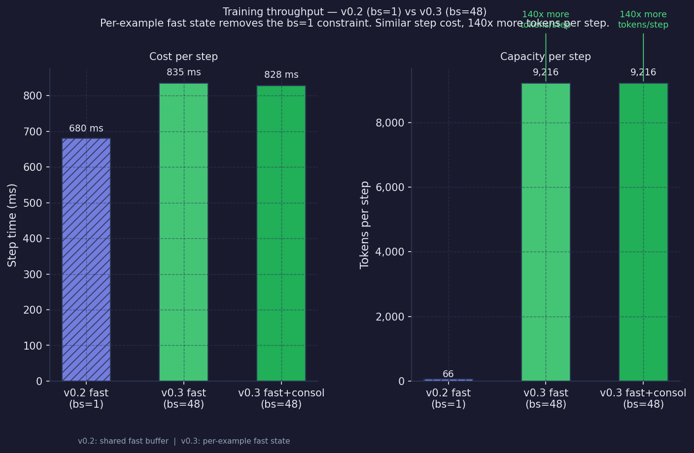

# bdh-fast-weights

BDH (Dragon Hatchling) is an architecture described in [arxiv:2509.26507](https://arxiv.org/abs/2509.26507) (Kosowski et al., 2025). The paper describes a Hebbian synaptic plasticity mechanism where weights update during inference. The [released code](https://github.com/pathwaycom/bdh) computes the co-activation product and discards it, so no write-back happens. This repo implements the write-back and shows it works, first on synthetic benchmarks and then on natural language.

This is a mechanism proof, not a product.

---

## v0.3: Does the mechanism activate on natural language?

Yes.



`fast_state_norm` is non-zero from step 1 on FineWeb-Edu. Hebbian updates accumulate in the fast buffer immediately and keep accumulating. An early peak appears around step 41 (norm ~4.1), followed by a retreat as slow weights adapt to the data, then steady growth to a sustained plateau. The baseline `fast_state_norm` is 0.0 throughout.



`fast_state_norm` stabilises near 11.2 and holds there across the full training run. Baseline `fast_state_norm` is 0.0 throughout.

By mid-training (around step 6,000 of ~12,000), `fast_contrib_norm` is approximately 6.9 and `slow_contrib_norm` is approximately 3.5. The model learned to use the fast buffer. The architecture did not force this.

---

## Does it show in the loss?

Partially.



5 runs on FineWeb-Edu, raw byte tokenisation. 3-hour budget, RTX 5070 Ti, context_len=192, d_model=768, batch_size=48.

| Run | Seed | Best val BPB | Best step | Tokens |
|---|---|---|---|---|
| Baseline (no fast weights) | 2026 | 1.6774 | 12000 | 111M |
| Fast weights, no consolidation | 2026 | 1.6768 | 12000 | 111M |
| Fast weights + row_topk consolidation | 1337 | 1.6690 | 11400 | 105M |
| Fast weights + row_topk consolidation | 2026 | **1.6685** | 12000 | 113M |
| Fast weights + row_topk consolidation | 2027 | 1.6832 | 12300 | 116M |

Fast weights alone match baseline within noise. Row_topk consolidation improves BPB by ~0.009 at seeds 1337 and 2026. A third seed (2027) did not reproduce it. No matched seed 2027 baseline was run, so a paired comparison is not possible.

Raw byte tokenisation is a deliberate choice. BDH's addressing mechanism uses token identity codes, and byte-level tokens provide stable, consistent addresses across all input. These are 3-hour runs on a small model. The BPB numbers are not comparable to tokenised models or larger architectures.

---

## What this is

The Hebbian fast-weight mechanism is active on natural language. fast_state_norm grows from step 1 and holds near 11.2. Baseline fast_state_norm is 0.0. The model learned to use the fast buffer. Fast weights contribute roughly twice as much as slow weights by mid-training.

Row_topk consolidation improves BPB by ~0.009 at 2 of 3 seeds on FineWeb-Edu. A third seed (2027) did not reproduce it.

## What this is not

Not validated on general language modelling tasks beyond the runs described. The BPB improvement is real at 2 seeds and small. These are 3-hour runs on a small model trained on raw bytes. Not a replacement for RAG or fine-tuning. Not Pathway's internal BDH implementation.

Eval is teacher-forced. Reported accuracies reflect teacher-forced exact-span scoring, not autoregressive generation.

---

## What changed in v0.3

- Per-example fast state: the bs=1 constraint is eliminated. v0.3 uses shape `[batch, memory_size, d_model]`. At bs=48, each training step processes 9,216 tokens vs 66 in v0.2, which is 140x more per step at similar step cost.
- Throughput cost: fast weight training runs at ~10,600 tokens/s vs ~65,000 tokens/s baseline. This is the cost of the per-token Hebbian update. It is not yet parallelised within a sequence.
- Context length extended to 192 tokens (from 128 in v0.1/v0.2).



```python
logits, next_fast_state = model(tokens, fast_state=fast_state)
```

---

## v0.2: Consolidation

v0.2 asked whether fast weights can consolidate into slow weights between sequences without destroying the associative memory signal. Dense writeback did destroy it. Selective writeback (`row_topk`) preserved it.

| Run | n2 | n4 | n8 | Interpretation |
|---|---|---|---|---|
| batch1-control-bpe192-opt3e-3-hebb1e-2-consol0-s1337 | 97.2% | 95.5% | 97.4% | no fast-to-slow consolidation |
| batch1-dense-bpe192-opt3e-3-hebb1e-2-consol1e-4-s1337 | 75.4% | 68.1% | 89.8% | dense writeback degrades the signal |
| batch1-rowtop10-bpe192-opt3e-3-hebb1e-2-consol1e-4-s1337 | 97.5% | 97.1% | 96.2% | selective writeback preserves most of the control signal |

`rowtop10`: after each episode, only the top 10% of decoder rows by episode-local fast-row activity are written from fast weights into slow weights.

Independent H100 verification (seed 2026):

| Run | n2 | n4 | n8 |
|---|---|---|---|
| verify-control-bpe192-s2026 | 72.7% | 80.6% | 85.2% |
| verify-rowtop10-bpe192-s2026 | 92.5% | 93.9% | 91.2% |

Counter-benchmarks for verify-rowtop10: 93.0% vargap1, 92.6% vargap2, 91.6% repeated8, 95.0% n16.

Confirmation runs at 2 independent seeds:

| Run | n2 | n4 | n8 |
|---|---|---|---|
| confirm-bpe-hebb-bpe192-lr3e-3-s1337 | 99.0% | 98.0% | 97.5% |
| confirm-bpe-hebb-bpe192-lr3e-3-s2026 | 88.7% | 88.8% | 92.0% |

Counter-benchmarks on confirmation runs:

| Run | vargap1 | vargap2 | repeated8 | n16 |
|---|---|---|---|---|
| confirm-bpe-hebb-bpe192-lr3e-3-s1337 | 95.8% | 93.0% | 97.2% | 96.8% |
| confirm-bpe-hebb-bpe192-lr3e-3-s2026 | 87.8% | 87.4% | 84.8% | 94.8% |

Five implementation bugs were found and fixed during development. See [BUGS.md](BUGS.md).

Note on eval methodology: an earlier version of the counter-benchmarks used autoregressive generation and showed apparent collapse. That was a scorer mismatch, not a mechanism failure. Both logs are preserved in `results/` for audit.

---

## v0.1: Synthetic benchmarks

v0.1 established that Hebbian fast-weight write-back works on synthetic n-back associative recall. Synthetic benchmarks were the starting point because the only path to above-chance performance is correctly writing and reading associations, with no language modelling shortcuts available. Baseline (no write-back): 1.0% n8 (random chance for vocab size 64).

| Run | n2 | n4 | n8 | Stopped |
|---|---|---|---|---|
| baseline-bpe192-nohebb | 0.0% | 0.0% | 1.0% | converged (~2 min) |
| bpe-hebb-bpe192-lr3e-3 | 89.4% | 87.2% | 95.1% | time limit (2h) |
| bpe-hebb-bpe192-lr1e-2 | 25.8% | 37.2% | 91.3% | time limit (2h) |
| bpe-hebb-bpe192-lr3e-2 | 18.0% | 22.2% | 72.2% | time limit (2h) |

All Hebbian runs were still improving at the 2-hour cutoff.

---

## The mechanism

At each token step the model projects the input through a ReLU-gated sparse encoder to produce an address code. The same token always produces the same code regardless of position. An outer product of this code with the decoder input is accumulated into a fast weight buffer using a Hebbian learning rate.

At read time, slow and fast weights combine:

```
output = xy @ decoder + x_sparse @ decoder_fast
```

Slow weights (`decoder`) hold general knowledge learned by gradient descent. Fast weights (`decoder_fast`) hold associations from the current sequence, written by Hebbian update. The fast buffer is zeroed before each sequence. No cross-sequence memory accumulation.

---

## Architecture constraints

**Batch size.** Resolved in v0.3. v0.2 required bs=1 (shared fast buffer). v0.3 uses per-example fast state, enabling batch_size=48.

**Throughput.** ~10.6k tokens/s with fast weights vs ~65k tokens/s baseline. Cost of the per-token Hebbian update. Not yet parallelised within a sequence.

**Episodic reset is mandatory.** The fast buffer is zeroed before each sequence. No cross-sequence memory accumulation.

**Context window.** v0.1/v0.2 used context_len=128. v0.3 uses context_len=192. v0.4 will investigate the minimum viable floor.

---

## How to reproduce

The v0.3 results use raw-byte FineWeb-Edu. Reproducing them requires downloading the corpus first.

```bash
pip install torch numpy flask datasets    # datasets needed for fetch_corpus.py
python fetch_corpus.py                    # streams FineWeb-Edu from HuggingFace (takes a while)
python prepare.py                         # packs corpus into byte shards and builds address map
```

Reproduce the baseline (no fast weights):
```bash
python train.py --label baseline_rawbyte256_validation_3h --hebbian-lr 0
```

Reproduce fast weights with row_topk consolidation:
```bash
python train.py --label fastmem_consolidation_rawbyte256_3h
```

Each run takes approximately 3 hours on a consumer GPU with 11GB VRAM.

Run mechanism ablation evals against a saved checkpoint:
```bash
python run_mechanism_evals.py --checkpoint results/checkpoints/<checkpoint>.pt
```

The ablation modes (fast_read_off, fast_write_off, fast_off, slow_read_off, fast_rows_shuffled) verify that the mechanism is doing what is claimed. All result logs are append-only. Nothing is overwritten.

Note: v0.1 and v0.2 results (synthetic n-back benchmarks) were produced with an earlier version of the code. The current codebase is v0.3 only.

### Data directories

By default, `fetch_corpus.py` and `prepare.py` write to `./data/` and training results go to `./results/`. Both are overridable:

```bash
BDH_DATA_DIR=/path/to/data BDH_RESULTS_DIR=/path/to/results python train.py ...
```

### Hardware

- RTX 5070 Ti Laptop GPU (11GB VRAM, CUDA 12.0)
- RunPod cloud GPU (24GB) for overnight sweeps

### Dashboard

```bash
python dashboard.py              # http://localhost:5000
```

### Results files (v0.3)

- `results/experiment_log.jsonl`: v0.3 FineWeb-Edu training runs
- `results/eval_history.jsonl`: per-checkpoint eval scores across training
- `results/counter_log.jsonl`: v0.2 counter-benchmark results (corrected teacher-forced eval)
- `results/counter_log_original_eval.jsonl`: v0.2 original autoregressive eval results, preserved for audit
- `results/char_level_experiment_log.jsonl`: v0.1 character-level experiments
- `snapshots/exp11_xsprev_shared_fastbuf_lr1e2_bs1.py`: frozen standalone script for the first working experiment (char-level, n8=64%), independently runnable

---

## Future work

- v0.4: minimum viable context window experiment, find the floor below which fast-weight addressing degrades
- v0.5: compression layer for MCP serving
- Longer training runs (current results are time-limited)
- Natural language benchmark performance, not mechanism activation but demonstrable downstream improvement
- Batched evaluation (now unblocked by per-example fast state)

---

## Compute and support

This project runs on a single consumer GPU (RTX 5070 Ti Laptop, 11GB VRAM). Longer runs and larger models would strengthen these results.

If you want to help:
- **GitHub Sponsors**: [github.com/sponsors/fleeb83](https://github.com/sponsors/fleeb83)
- **Checkpoints**: Not currently hosted due to storage limits. Hugging Face hosting would make this practical. If you can help, open an issue.
- **Collaboration**: Issues and pull requests are open.
- **Compute**: If you have GPU time and want to run validation experiments, get in touch.

No obligation. Apache 2.0.

Contact: open a GitHub issue or find Russell Thomas on Reddit (u/fleeb83).

---

## Prior art note

The only other known open-source attempt at BDH Hebbian write-back is [`adamskrodzki/bdh`](https://github.com/adamskrodzki/bdh). A full audit found the forward pass is byte-for-byte identical to upstream. A single unused `lm_gate` parameter was added but never wired in. The mechanism was not implemented.

---

## Acknowledgements

- **BDH architecture**: Kosowski, Uznański, Chorowski, Stamirowska, Bartoszkiewicz. [arxiv:2509.26507](https://arxiv.org/abs/2509.26507), [github.com/pathwaycom/bdh](https://github.com/pathwaycom/bdh)
- **Fast Weight Programmers**: Schlag, Irie, Schmidhuber. [arxiv:2102.11174](https://arxiv.org/abs/2102.11174)
- **In-context learning as gradient descent**: von Oswald et al. [arxiv:2212.07677](https://arxiv.org/abs/2212.07677)
- **Autoresearch framework**: Andrej Karpathy. [github.com/karpathy/autoresearch](https://github.com/karpathy/autoresearch)

---

## Author

**Russell Thomas**, independent researcher, Kaniva, Victoria, Australia.

No university affiliation. No corporate lab.

## License

Apache 2.0. See [LICENSE](LICENSE).
